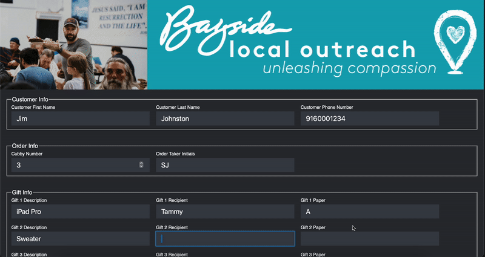
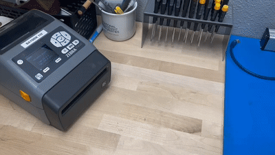
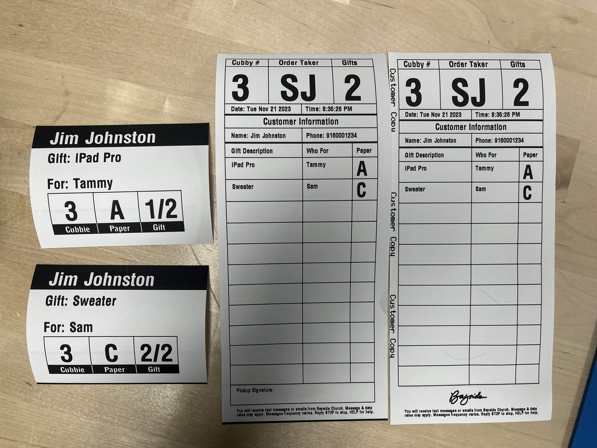

# Gift Wrap Receipt Printer

This app allows the gift wrap station to print receipts and tags.

## Notice

This app is not hosted on the internet because the connection to the printer is over http, and the web browser will not allow a mixed content connection.

## Getting Started
* Download the code as a zip file
* Open the index file to launch the app

## Network Setup
* The printer needs to be on the same local network as the printer

## Updates
* If an update is available, please delete the files from the previous version before downloading the new one

## Author
Zack Dutra

## Version History

* 0.1
    * Initial Release
